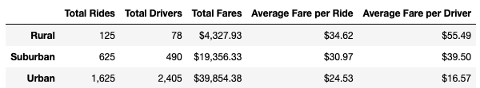
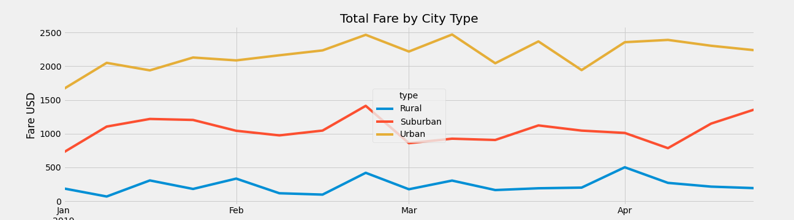

# PyBer_Analysis

Analysis ride-share data 

## Overview

The purpose of this project is to create a visualization of the data of the distribution of drivers and rates

Urban users paid less than rural because cities have more drivers. In summary, we can detect that it is more profitable the rural cities service

